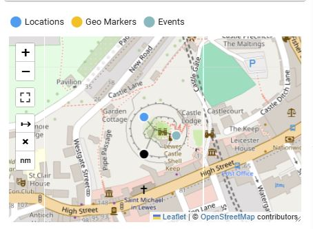

# Bulletin Fields Reference

_Based on bulletin 2 — the X (Twitter) post — in the local dev instance._

> **Limitations once a bulletin is saved:**
> - **Cannot be deleted** — there is no delete button in the UI. Deletion requires a direct API call (`DELETE /admin/api/bulletin/<id>`).
> - **Access roles cannot be changed** — the roles field is only shown on the create form, not the edit form.

---

## Toolbar area

### ID
- **What it is:** Auto-generated internal identifier. Read-only.
- **Table/column:** `bulletin.id`
- **Bulletin 2:** `1`

### Origin ID
- **What it is:** The identifier from the original source platform — e.g. a tweet ID, Facebook post ID, YouTube video ID. Displayed as a chip that links to the Source Link URL.
- **Table/column:** `bulletin.originid` (`varchar`, GIN trigram index for fuzzy search — a GIN trigram index breaks the value into 3-character chunks so partial string matches like `%12345%` are fast without a full table scan)
- **Bulletin 2:** `1234567890` (the tweet ID, links to `https://x.com/lewes_observer/status/1234567890`)

### Assigned To
- **What it is:** The analyst currently responsible for this bulletin.
- **Table/column:** `bulletin.assigned_to_id` → FK to `user.id`
- **Bulletin 2:** Analyst One

### Status
- **What it is:** Current workflow state. Drives the peer review process.
- **Table/column:** `bulletin.status` (`varchar`) — values come from `workflow_statuses` table
- **Bulletin 2:** `Assigned`

### Access Roles (lock icon)
- **What it is:** Groups that can see this bulletin. If empty, all DA/Mod users can see it (in non-restrictive mode). If set, only users sharing a listed role can access it.
- **Only available when creating a new bulletin** via the edit form — the roles field is hidden on the edit form (`v-if="!editedItem.id"` in `bulletin_dialog.html`). However, access roles **can be changed after creation** via **Bulk Update**: select the bulletin(s) → Bulk update → set Access Groups + tick **Replace**.
- **Table/column:** M2M — `bulletin_roles` join table → `role.id`
- **Bulletin 2:** _(none — open access)_

### Tags (tag icon)
- **What it is:** Free-text keyword array set by the analyst. Unstructured — not linked to any reference table. Searchable via GIN index.
- **Table/column:** `bulletin.tags` (`varchar[]`)
- **Bulletin 2:** `Lewes`, `castle siege`, `protest`, `crowd`, `X post`, `East Sussex`, `open source`

### Source Link
- **What it is:** URL to the original source material. Can also be set to `NA` (not available) or `Private`.
- **Table/column:** `bulletin.source_link` (`varchar`)
- **Bulletin 2:** `https://x.com/lewes_observer/status/1234567890`

---

## Main content fields

### Original Title
- **What it is:** The title or text exactly as it appeared in the source material — e.g. the tweet caption, document heading, or post text. Bilingual (English + Arabic toggle).
- **Table/column:** `bulletin.title` / `bulletin.title_ar` (`varchar(255)`)
- **Bulletin 2:** `Unbelievable scenes at Lewes Castle right now. Hundreds here. #LewesCastle`

### Title (SJAC Title)
- **What it is:** The analyst's own normalised, neutral title for the bulletin. Used internally for consistent naming across bulletins.
- **Table/column:** `bulletin.sjac_title` / `bulletin.sjac_title_ar` (`varchar(255)`)
- **Bulletin 2:** `X post: crowd gathered at Lewes Castle gate - 17 Mar 2026`

### Description
- **What it is:** Full analyst notes about the bulletin content — what the source shows, context, observations. Stored as HTML (TinyMCE editor).
- **Table/column:** `bulletin.description` (`text`)
- **Bulletin 2:** _Image posted to X (formerly Twitter) by @lewes_observer at 14:22 GMT on 17 March 2026. Shows approximately 200 people gathered at the barbican entrance to Lewes Castle..._

### Map
- **What it is:** An interactive Leaflet map aggregating three types of location data from the bulletin, each shown in a different colour:
  - **Blue — Locations:** The structured location hierarchy entries (from the Locations field). Plotted at the centroid of the location record.
  - **Yellow/Orange — Geo Markers:** Precise coordinate pins entered directly on the bulletin (from the Geo Markers field). These are the `geo_location` rows.
  - **Teal — Events:** The locations attached to events linked to this bulletin.
  - **Black — Main geo marker:** Any geo marker with `main = true` is overridden to black regardless of its type colour. Indicates the primary incident location.
- **Table/column:** `geo_location` table, `bulletin_id` FK. Each row has `title`, `latlng` (PostGIS point), `type_id` → `geo_location_types`, `main` (boolean), `comment`.
- **Bulletin 2:** One marker — "Lewes Castle", lat `50.8729`, lng `0.0074`, type "Historic Monument", marked as main incident location.

### Sources
- **What it is:** The publication or platform the bulletin originated from. Reference data — shared across bulletins.
- **Table/column:** M2M — `bulletin_sources` join table → `source.id` (`source.title`)
- **Bulletin 2:** `X (Twitter)`

### Events
- **What it is:** Timestamped occurrences documented within this bulletin. Each event has a title, type, from/to dates, and an optional location from the location hierarchy. **A bulletin can have multiple events** — the link is M2M, so there is no limit. In practice most bulletins carry one event, but a single source (e.g. a long news article) could document several distinct occurrences.
- **Table/column:** `event` table, linked via `bulletin_events` M2M join table. `event.eventtype_id` → `eventtype`. `event.location_id` → `location`.
- **Bulletin 2 (X post):** Two events:
  1. "Crowd forces entry through barbican gate" — type `Incident`, 14:00–14:30 on 17 March 2026, at Lewes Castle. _(what the post documents)_
  2. "X post published by @lewes_local" — type `Publication`, 14:22 on 17 March 2026, at Lewes Castle. _(when the source appeared)_

### Labels
- **What it is:** Unverified (descriptive) labels — applied during initial triage based on what the source alleges or appears to show. Analyst's working classification.
- **Table/column:** M2M — `bulletin_labels` join table → `label.id`. `label.verified = false`.
- **Bulletin 2:** `Crowd / Gathering`, `Heritage Site Threatened`, `Siege / Occupation`, `Protest / Demonstration`

### Verified Labels
- **What it is:** Verified (neutral, evidence-based) labels — applied during peer review. Factual classifications confirmed by an analyst.
- **Table/column:** M2M — `bulletin_verlabels` join table → `label.id`. `label.verified = true`.
- **Bulletin 2:** `Social Media Post`, `Image`, `Outdoor Scene`, `Multiple Persons Visible`, `Historic Structure Visible`, `Priority`

### Locations
- **What it is:** Links to the structured location hierarchy — classifies where the bulletin is about, for filtering and search. Not a map pin — use Geo Markers for coordinates.
- **Table/column:** M2M — `bulletin_locations` join table → `location.id`. Display uses `location.full_location` (denormalised path string).
- **Bulletin 2:** `Lewes Castle, Lewes, East Sussex`

### Related Bulletins
- **What it is:** Links to other bulletins with a typed relationship (Duplicate, Same Event, Corroborates, Contradicts, etc.) and a probability score.
- **Table/column:** `btob` table — `bulletin_id_1`, `bulletin_id_2`, `related_as` (int → `btob_info`), `probability` (0=Maybe, 1=Likely, 2=Certain).
- **Bulletin 2:** _(none)_

### Related Actors
- **What it is:** Links to actors (people/organisations) with a typed relationship (Appeared, Witness, Perpetrator, etc.) and a probability score.
- **Table/column:** `atob` table — `actor_id`, `bulletin_id`, `related_as` (`integer[]` → `atob_info`), `probability`.
- **Bulletin 2:** Thomas Ashdown — `Appeared`, Certain (2)

### Related Incidents
- **What it is:** Links to incidents (violation folders) with a typed relationship (Primary Evidence, Supporting Evidence, Context, etc.) and a probability score.
- **Table/column:** `itob` table — `incident_id`, `bulletin_id`, `related_as` (int → `itob_info`), `probability`.
- **Bulletin 2:** Unlawful occupation and criminal damage — Lewes Castle, 17–19 March 2026 — `Primary Evidence`, Certain (2)

### Publish Date
- **What it is:** When the original source material was published.
- **Table/column:** `bulletin.publish_date` (`timestamp`)
- **Bulletin 2:** `2026-03-17 14:22`

### Documentation Date
- **What it is:** When the analyst documented this bulletin in Bayanat.
- **Table/column:** `bulletin.documentation_date` (`timestamp`)
- **Bulletin 2:** `2026-03-17 16:00`

### Media
- **What it is:** Files attached to the bulletin — images, video, documents. Stored on disk; DB holds metadata and path.
- **Table/column:** `media` table — `bulletin_id` FK, `media_file` (filename), `title`, `category` → `media_categories`.
- **Bulletin 2:** `lewes-castle.png` — "Crowd at Lewes Castle barbican gate — posted to X by @lewes_observer"

---

## Fields not visible in bulletin 1 (but exist on the model)

| Field | Column | Notes |
|---|---|---|
| Reliability Score | `bulletin.reliability_score` (`int`) | Bulletin 1 has `40` but not displayed in view card |
| Comments | `bulletin.comments` (`text`) | Analyst working notes, not shown in view |
| Peer reviewers | `bulletin.first_peer_reviewer_id`, `second_peer_reviewer_id` | FKs to `user.id` |
| Review text | `bulletin.review` (`text`) | Only shown when status = Peer Reviewed |
| Review action | `bulletin.review_action` | Chip shown alongside review text |
| Created by | `bulletin.user_id` → `user.id` | Admin |
